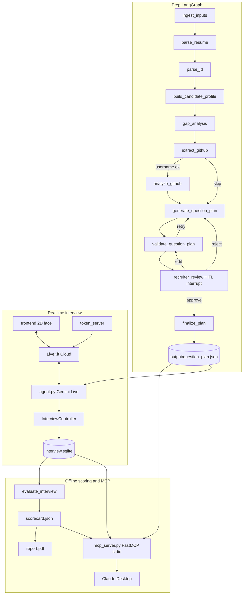

# FirstRound — Architecture

Technically accurate description of the **current** implementation. Spec: `FirstRound-Final-Test.pdf`.

## 1. System overview

FirstRound is a three-stage AI interviewing system:

1. **Prep (offline LangGraph)** — Parse JD + resume PDF, pull GitHub evidence, build a 12-question plan, pause for recruiter HITL (approve / edit / reject).
2. **Live call (realtime)** — Candidate joins a browser room; a local LiveKit Agents worker speaks via **Gemini Live native audio**; a local **2D face** animates from agent audio. Vendor avatars are disabled.
3. **After (offline)** — Persist transcript in SQLite, evaluate, emit PDF grading artifacts (`transcript.json`, `scorecard.json`, `report.pdf`), and expose recruiter tools over **FastMCP stdio** (Claude Desktop).

MCP is **not** on the LiveKit / Gemini audio path.

## 2. End-to-end flow

```text
inputs/jd.txt + inputs/resume.pdf + GitHub URL
        │
        ▼
 LangGraph prep (SqliteSaver) ──HITL──► output/question_plan.json (approved)
        │
        ▼
 Browser (frontend) ◄── tokens ──► token_server.py
        │                              │
        │                              ▼
        └──── LiveKit room ◄──► agent.py (Gemini Live + InterviewController)
                                      │
                                      ▼
                         output/live/interview.sqlite
                         output/interview_transcript.json
                                      │
                                      ▼
                    evaluate → scorecard adapter → report.pdf
                                      │
                                      ▼
                         mcp_server.py (stdio) ◄── Claude Desktop
```

## 3. Architecture diagram



## 4. Graph / LangGraph structure

**Source:** `src/graph.py`  
**Checkpointer:** `langgraph.checkpoint.sqlite.SqliteSaver` at `output/prep/langgraph.sqlite`  
**Purpose:** Offline prep only (not the live turn loop).

### Nodes (11)

| Node | Role |
|------|------|
| `ingest_inputs` | Load resume PDF + JD text |
| `parse_resume` | Structured resume JSON |
| `parse_jd` | Structured JD JSON |
| `build_candidate_profile` | Combined profile |
| `gap_analysis` | Claim vs JD vs evidence gaps |
| `extract_github` | Resolve GitHub username/URL |
| `analyze_github` | REST pull of repos / files / commits |
| `generate_question_plan` | 12 questions |
| `validate_question_plan` | Quality + banned checks |
| `recruiter_review` | `langgraph.types.interrupt` HITL |
| `finalize_plan` | Write approved plan |

### Conditional edges (≥2)

1. After `extract_github` → `analyze_github` or skip to `generate_question_plan`
2. After `validate_question_plan` → regenerate / `recruiter_review` / `finalize_plan`
3. After `recruiter_review` → regenerate (reject) / re-validate (edit) / finalize (approve) / wait

### State object (`InterviewPrepState`)

Key fields: `resume`, `jd`, `candidate_profile`, `gap_analysis`, `github*`, `questions`, `validation`, `generation_attempt`, `recruiter_action`, `approval_status`, `edits_made`, `final_plan`, `sample_mode`, plus error/warning lists.

### HITL

`src/nodes/hitl.py` calls `interrupt(...)`. CLI resume via `src/prepare_interview.py` with `--resume-action approve|edit|reject`. Live interview requires an **approved** plan (`approved_by_human=true`).

## 5. Realtime interview architecture

| Piece | Implementation |
|-------|----------------|
| Transport | LiveKit Cloud; local worker `python src/agent.py start` |
| Model | `gemini-2.5-flash-native-audio-preview-12-2025` (`src/config.py`) |
| Mode | `FIRSTROUND_MODE=voice` only; vendor avatar mode not implemented |
| Controller | `src/realtime/controller.py` — question index, follow-ups, wrap-up |
| Follow-ups | Shallow / off-topic / bluff → probe; **max 2** per topic (`MAX_FOLLOW_UPS=2`) |
| Strong answers | Skip further probes and **advance** to the next plan question (plan-ordered difficulty; no separate dynamic “raise difficulty” rewriter) |
| Barge-in | LiveKit / Gemini Live interruption; agent logs `[INTERRUPT] Agent interrupted` |
| Timer | `INTERVIEW_LIMIT_SECONDS = 480`; wrap-up when limit reached |
| Face | Local 2D portrait + mouth animation in `frontend/` driven by agent audio energy (not Simli/Tavus) |

Live drop recovery uses **`InterviewStore.restore_from_record`** / `InterviewController.restore_from_record` (SQLite), **not** a LangGraph live-session checkpointer.

## 6. Transcript and SQLite persistence

- Live turns persist to `output/live/interview.sqlite` (`src/realtime/store.py`).
- Agent also writes `output/interview_transcript.json`.
- PDF grading export: `src/realtime/transcript_export.py` → `output/transcript.json` (`speaker`, `text`, `timestamp_ms`, `node`, `interrupted`).
- Graded export for the Taha interview is produced by `src/generate_grading_artifacts.py` (manual/offline), not automatically on every LiveKit hangup.

## 7. Offline evaluation flow

1. Load approved plan + transcript turns.
2. `src/realtime/evaluate_interview.py` — per-question / overall scoring (legacy 0–100 style internals).
3. `src/realtime/scorecard.py` — map to PDF scorecard schema; **reject scores without a verbatim candidate quote** (≥12 characters).
4. Optional persona evals: `evals/run_evals.py` → `evals/results.md` (synthetic transcripts; not the live Taha take).

## 8. Scorecard and PDF report

- `output/scorecard.json` — PDF §6 fields (`competencies[]`, `recommendation`, `guardrail_flags`, etc.).
- `output/report.pdf` — `src/realtime/pdf_report.py` (reportlab) from the scorecard.
- Current graded Taha artifact (`AJ_mPYT3PkhgjPw`): **partial**, **9/12** questions, **482s**, **overall 3.6**, **`borderline`**.  
  Written to `output/transcript.json`, `output/scorecard.json`, `output/report.pdf`.  
  Prior take backed up under `output/backup-taha-live-20260814/`.

## 9. MCP recruiter layer

- Entry: `src/mcp_server.py` (FastMCP stdio). Default `mcp.run()`.
- Not on the audio path; does not start LiveKit or Gemini Live.

**Tools registered:**

| Tool | Notes |
|------|--------|
| `get_interview_status` | SQLite status |
| `get_interview_transcript` | Turns only |
| `get_current_question` | Active question only |
| `get_interview_report` | Offline report if available |
| `list_interviews` | Recent interviews |
| `get_question_plan` | Approved plan summary |
| `get_github_evidence` | Plan repo/file/SHA (no live GitHub API) |
| `get_candidate` | Candidate summary (PDF-required) |
| `save_score` | Validates evidence quotes → `output/scorecard.json` |
| `get_scorecard` | Read scorecard (PDF-required) |

Claude Desktop config points at the project venv Python + this script.  
Proof screenshots:
- MCP tools: `submission/screenshots/claude-mcp-tools-1.png`, `submission/screenshots/claude-mcp-tools-2.png`
- HITL review: `submission/screenshots/hitl-recruiter-review.png`

## 10. Frontend candidate flow

`frontend/` served by `src/token_server.py` at `http://127.0.0.1:8080`:

1. Landing → setup (name + mic check) → live interview → complete.
2. Shows 2D avatar (`frontend/public/avatar.png`), timer, barge-in hint.
3. Does **not** display scores, scorecard, or hire recommendation.

## 11. Measured latency

**PDF target (spec):** &lt; 1.2 s from candidate stops speaking to agent starts speaking. That is a **grading target**, not a hardcoded constant in this repo.

**Instrumentation:** `src/agent.py` logs:

```text
[LATENCY] candidate_stop_to_agent_audio_ms=<integer>
```

**Documented measured sample** (README / runtime example, not a baked constant):

```text
[LATENCY] candidate_stop_to_agent_audio_ms=842
```

`842 ms` is below the 1.2 s target. Additional live sessions may log different values; only logged measurements should be cited in `SUBMISSION.md`.

## 12. Known limitations (current)

- Live interview resume is SQLite controller restore, not LangGraph-on-the-live-call.
- Strong-answer path advances the plan; it does not rewrite question difficulty mid-topic.
- Graded Taha transcript (`AJ_mPYT3PkhgjPw`) is **partial (9/12)**; elapsed ~482–533 s with wrap-up.
- Some exported agent transcript lines look like eval/trigger text (e.g. short labels), not full spoken utterances.
- Graded `transcript.json` has `interrupted: false` on all turns (barge-in may still occur in audio without that flag set).
- Layout differs from PDF tree in places: MCP lives at `src/mcp_server.py` (not root `mcp_server/`); banned/evidence logic lives under `src/prep/banned.py` and `src/realtime/scorecard.py` (not `src/guardrails/`).
- No Tier-1 / Tier-2 bonus features implemented (no deployed public URL, bias audit, etc.).
- `.env` with populated keys has been present in git history/tracking — must not remain in a public submission; rotate keys if exposed.

## 13. Security / secrets

- Secrets loaded from `.env` via `python-dotenv` (`src/config.py`). Never logged as values.
- `.env.example` lists key **names** only.
- MCP tools use fixed application paths; clients cannot pass arbitrary filesystem paths.
- MCP does not return `.env` / API keys; unknown IDs return structured errors.
- `save_score` applies evidence-quote validation before writing `output/scorecard.json`.
- Banned-topic sanitization before questions are spoken (`src/prep/banned.py` / plan loader path).

## 14. Project tree (overview)

```text
AI-Season-Final/
├── ARCHITECTURE.md          (this file)
├── SUBMISSION.md
├── README.md
├── .env.example
├── requirements.txt
├── FirstRound-Final-Test.pdf
├── inputs/                  jd.txt, resume.pdf
├── prompts/                 + ITERATION_NOTES.md
├── evals/                   personas/, run_evals.py, results.md
├── frontend/                index.html, app.js, styles.css, public/avatar.png
├── submission/screenshots/  Claude MCP + HITL proof
├── output/
│   ├── prep/                jd.json, resume.json, github.json, question_plan.json, langgraph.sqlite
│   ├── question_plan.json   approved plan used by live agent
│   ├── live/interview.sqlite
│   ├── interview_transcript.json
│   ├── transcript.json      PDF path
│   ├── scorecard.json       PDF path
│   └── report.pdf           PDF path
└── src/
    ├── graph.py             prep LangGraph
    ├── prepare_interview.py
    ├── agent.py             LiveKit + Gemini Live
    ├── token_server.py
    ├── mcp_server.py
    ├── nodes/               prep nodes including hitl.py
    ├── agents/              jd/resume/github/question_planner
    ├── prep/                banned, github_api, pdf, llm, …
    └── realtime/            controller, store, evaluate*, scorecard, pdf_report, …
```
